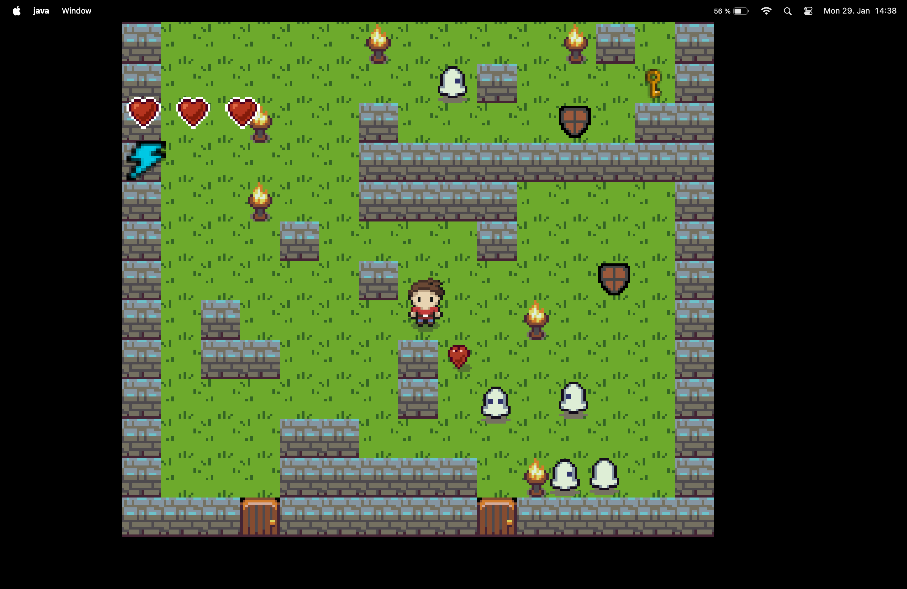

# Maze Runner Game

Maze runner game is an interactive game where the player has to go through the maze looking for a key to open the exit doors and escape the maze while avoiding enemies and obstacles. 

## Rules

- Player has three lives.
- Once the player gets inside the maze, the entrance gets closed, and he cannot leave, unless he goes through the exit.
- If the player gets hit by an enemy or falls into a trap he loses one life.
- Player is able to pick up shield power-up, which makes him invincible for three seconds to the enemies.
- Player is able to pick up extra heart in case he has less than three lives.
- Player is able to use speed boost for two seconds. After using the speed boost, there is an eight-second cool-down, before he is able to use it again.
- To exit the maze, player first has to pick up a key, then he will be able to go through the exit.
- Player can customize his own levels by adding a .properties file in the maps directory. The name of the file must have the form "level-[number of the level].properties".

## Controls

- Use arrow keys to navigate through the maze.
- Press [Space] to use speed boost.
- Press [Esc] to pause/resume the game.
## Dependencies
- Open JDK 17

## Gameplay

